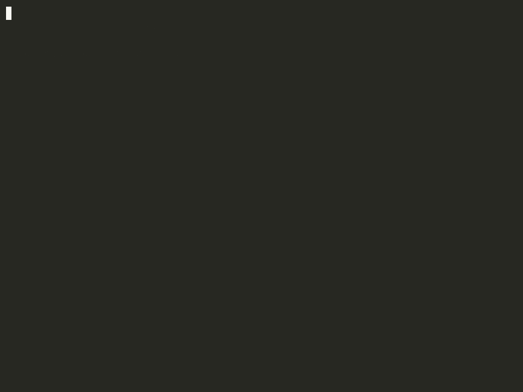

# orkia

**Your shell runs commands. orkia runs agents.**

bash launches a process and forgets it. orkia owns it. Every Claude Code,
Codex, or Gemini session runs as a governed job inside an isolated PTY —
tracked like a Unix process, policed like one, and recorded in a signed,
tamper-evident audit chain you can replay later.

A command can fire an agent. Only a shell can own its life.

orkia is not a wrapper around `claude`. It's the shell underneath it. Built on
the [`brush`](https://github.com/reubeno/brush) POSIX engine — everything bash
does still works.

<!--
  DEMO GOES HERE.
  Replace the line below with the recorded session GIF once exported.
  Keep it directly under the hero, above the static code block.

  
-->


```sh
# Fire a coding agent into the shell as a real job. @faye is the
# engineering agent (backed by Claude Code; Codex- and Gemini-backed agents
# work the same way).
$ @faye refactor the auth module to use the new token type
[job 1] faye · running · pty/3

# It's a job. The REPL isn't blocked — list jobs while it works.
$ ps
 AGENTS
 JOB  AGENT   STATUS   CMD                                             RUNTIME
 1    faye    running  refactor the auth module to use the new token…  0m12s

# Do normal shell things in the meantime.
$ git status
On branch main
Changes not staged for commit:
  modified:   crates/orkia-auth/src/lib.rs

# When it's done, replay everything it did — on a signed, tamper-evident chain.
$ audit --job 1
⛓ SEAL chain · job 1 (faye) · 14 records · closed
  ...
⛓ chain verified ✓

# Or just verify the chain is intact, end to end.
$ audit verify --job 1
⛓ audit verify · job 1 (faye)
  ✓ 14 records · SHA-256 chain intact · verify ok
```

> A representative session. Agent dispatch (`@faye …`), `ps`, and `audit` are
> real commands; record counts and timings will differ from your run.

Nothing here phones home. Local-first, BYO key, runs offline.

## Quickstart

Install the release binary with one command:

```bash
curl -fsSL https://orkia.dev/install | sh
orkia
```

The installer fetches a release binary, verifies its Ed25519 signature against
the published release key, and puts `orkia` on your `PATH`. Prefer to inspect
first? Pipe the script to a file and read it before running.

Once you're in: it's still your shell. `ls`, `cd`, pipes, and jobs all work —
orkia is built on the [`brush`](https://github.com/reubeno/brush) POSIX engine.

### Prerequisites

The shell runs standalone, but firing an agent (`@faye …`) requires at least
one agent CLI installed and authenticated — [Claude
Code](https://docs.anthropic.com/en/docs/claude-code), Codex, or Gemini. orkia
is **bring-your-own-key**: it never proxies your prompts or holds your
credentials.

### Dispatching an agent

Every `@agent` you fire from the prompt is **daemon-owned**: it runs in the
orkia daemon, not the REPL, so it **survives `exit`** — relaunch the shell and
`ps` still lists it. Two independent choices shape a dispatch:

- **Attachment** — does your terminal splice onto the live agent TUI?
- **Lifecycle** — does the session stay alive after its turn, or run once and go?

These are orthogonal, so there are four foreground forms:

|                       | persistent *(default)* — idles after its turn, `tell`/`attach`-able until `kill` | one-shot (`--once`) — runs one turn, prints its final response, exits, is reaped |
|-----------------------|------------------------------------|------------------------------------|
| **attached** *(default)* — splices onto the live TUI (`Ctrl-Z` detaches) | `@faye review src/auth.rs` | `@faye --once review src/auth.rs` |
| **background** (`&`) — returns to the prompt at once, no TUI | `@faye review src/auth.rs &` | `@faye --once review src/auth.rs &` |

All four are daemon-owned and survive shell exit; the only differences are
whether you land *inside* the session and whether it outlives its first turn.
`&` controls **attachment only** — a backgrounded agent is just as durable as an
attached one (it is not an in-process shell job that dies with the REPL).

For non-interactive launches (scripts, cron, `cat file | orkia …`), the same
daemon dispatch is reachable with the `--detach` flag:

```bash
orkia --detach -c '@faye --once review src/auth.rs'   # fire and return; the job runs in the daemon
```

This is the same ownership as a prompt `@faye` — a different *entry point*, not a
stronger survival guarantee.

### Build from source

```bash
# The shell has no system deps beyond a working libc. A debug build needs no
# extra configuration:
cargo build --bin orkia
./target/debug/orkia --version

# A --release build is locked to a production kernel key (SEC-003): it will not
# compile without ORKIA_KERNEL_PUBKEY_HEX set. For local release builds, export
# any 64-hex-char Ed25519 public key (SEAL chains just won't verify against the
# real kernel). See CONTRIBUTING.md for details.
export ORKIA_KERNEL_PUBKEY_HEX=<64-hex-char ed25519 public key>
cargo build --release --bin orkia
```

Source-available under **Elastic License 2.0**; plugin SDK and build tooling
under **Apache License 2.0**. Full per-crate breakdown in [`LICENSE`](LICENSE).

---

## What orkia is

orkia is an agentic shell that replaces bash/zsh and hosts AI agents
(Claude Code, Codex, Gemini, and others) inside isolated PTYs. It is not an
application — it is infrastructure. It runs 24/7, owns every agent process,
every command, every workflow.

This workspace holds the shell core (REPL, classifier, router, SEAL), the
PTY/terminal engine, the TUI renderer, and the shared data types used across
the project. The CLI binary lives in `bins/orkia`.

## Subsystems

Five subsystems carry the weight. Each maps to a directory so you know where
code lives:

- **RFC** (`crates/orkia-rfc-*`, `bins/orkia` `rfc` builtin) — the primary
  primitive. A short markdown+TOML contract describing *what changes and why*,
  used both to contribute to this repo and to drive work at runtime. See
  [`docs/rfc-primitive.md`](docs/rfc-primitive.md).
- **SEAL** (`crates/orkia-shell/src/seal`) — the signed, tamper-evident audit
  chain. Every agent job and project gets a hash-linked JSONL chain; replay and
  verify with the `audit` builtin.
- **Cage** (`bins/orkia-cage`, `bins/orkia-sh`) — the execution boundary that
  mediates what a running agent is allowed to do, command by command.
- **`cap`** (`crates/orkia-capabilities`, `cap` builtin) — plan-to-capability
  resolution: which capabilities a given plan grants an agent.
- **Kernel client** (`crates/orkia-kernel-*`) — the local IPC client and trust
  anchor. The kernel daemon and its learned services are part of Orkia OS; this
  repo ships the client and a dev trust key.

> The ATLAS coordinator and `oos-sys` learned services referenced in design
> docs live in the commercial Orkia OS, not this repo (see the table below).

## Architectural principles

The design follows a small number of non-negotiable rules (see `CLAUDE.md` for
the full text):

- **Durability over speed of implementation.** Channels and dedicated threads
  beat `Arc<Mutex<T>>` on shared state; pick the structurally sound option even
  when it costs more plumbing.
- **No band-aids on structural problems.** If a component keeps growing
  workarounds, rewrite it.
- **The REPL main loop is sacred.** It never blocks on I/O other than user
  input; side effects happen on dedicated threads, and event draining runs
  every iteration.
- **One owner per resource.** PTY master fds, the alacritty `Term` grid, the
  journal store, agent job state — each lives behind exactly one thread/struct.
  Other code communicates by message-passing.
- **Treat every byte as untrusted.** Bytes from a PTY, the journal socket, or
  user stdin are parsed defensively; malformed escape sequences must not crash
  the shell.

## Crates

### Shell core

- [`crates/orkia-shell-types`](crates/orkia-shell-types) — shared types and
  trait definitions (`Decision`, `Mode`, `ShellRenderer`, `AgentRouter`,
  `IntentClassifier`, `JobInfo`, `SealRecord`, `Workspace`, …). No I/O, no
  business logic.
- [`crates/orkia-shell`](crates/orkia-shell) — the REPL, decision engine,
  brush-backed shell engine, classifier and router implementations, SEAL
  emitter, job controller, journal store, approval watcher, and agent context
  plumbing.
- [`crates/orkia-builtin`](crates/orkia-builtin) — builtin commands (`ps`,
  `aroute`, `approve`, `agent`, `briefing`, `rfc`, `issue`, `project`,
  `config`, `history`, `kill`, `migrate-rc`, …).

### Shared libraries

- [`crates/orkia-entities-core`](crates/orkia-entities-core) — canonical entity
  types shared across the Orkia ecosystem (`AgentCore`, `WorkspaceCore`,
  `IssueCore`, `RfcCore`, `SealRecordCore`, …) and the wire-format envelopes
  for bootstrap/delta sync.
- [`crates/orkia-difficulty-scorer`](crates/orkia-difficulty-scorer) — prompt
  complexity scoring (structural + English-language signals) with no external
  dependencies, used for routing and tier selection.
- [`crates/orkia-model-catalog`](crates/orkia-model-catalog) — canonical model
  capability catalog (`ModelProfile`, `IntentQuality`) with a seed function
  returning the built-in reference set.

### PTY / terminal engine

- [`crates/orkia-pty`](crates/orkia-pty) — generic PTY abstraction over
  `portable-pty` + `alacritty_terminal`. No engine logic.
- [`crates/orkia-terminal-core`](crates/orkia-terminal-core) — the three-thread
  lock-free terminal engine (Reader / Extractor / Render) packaged behind
  `TerminalEngine`.
- [`crates/orkia-shell-tui`](crates/orkia-shell-tui) — `ratatui`-based
  `ShellRenderer` implementation with sidebar, scrollable block log, input bar,
  and attached-PTY widget.

### Binaries

- [`bins/orkia`](bins/orkia) — the `orkia` CLI binary. Routes between shell mode
  (default), TUI mode (`--tui`), stdout mode (`--no-tui`, pipes, CI),
  `-c <command>` single-shot mode, and CLI subcommands (`setup`, `migrate-rc`,
  `bridge`, `journal`).

## Build

The workspace uses Rust edition 2024 with MSRV 1.92, pinned in
`rust-toolchain.toml`. Install the toolchain via [rustup](https://rustup.rs) —
the pinned channel is honoured automatically.

### Building the shell

The `orkia` binary has **no system dependencies** beyond a working libc. Debug
builds need no extra configuration:

```bash
# Debug build — compiles with a dev kernel key, no env vars needed
cargo build --bin orkia
./target/debug/orkia --version

# Release build — requires the production kernel key (SEC-003). Export any
# 64-hex-char Ed25519 key for local builds; the official release sets the real
# one. See CONTRIBUTING.md ("Release builds need ORKIA_KERNEL_PUBKEY_HEX").
export ORKIA_KERNEL_PUBKEY_HEX=<64-hex-char ed25519 public key>
cargo build --release --bin orkia
./target/release/orkia --version
```

### Building the full workspace (contributors)

Building `--workspace` additionally compiles `orkia-forge-viewer-bin`, a
Tauri-based desktop preview that pulls GTK/WebKit2 system libraries on Linux.
The shell itself does not need any of this — only run the workspace-wide
commands if you are working on `orkia-forge-viewer*`.

```bash
# Linux only — system deps for the forge-viewer Tauri build
sudo apt-get install -y \
  libgtk-3-dev libwebkit2gtk-4.1-dev libsoup-3.0-dev \
  libayatana-appindicator3-dev librsvg2-dev pkg-config

# Workspace build, tests, and lint (zero-warnings policy)
cargo build
cargo test --workspace
cargo clippy --workspace --all-targets -- -D warnings
cargo fmt --all --check
```

macOS contributors do not need the GTK packages — the Tauri build links against
system frameworks already present.

### Local brush development

The `brush-core` / `brush-parser` / `brush-builtins` dependencies are pinned to
a fork of the `brush` shell engine at a specific revision (`5a50c12e` at the
time of writing). For local development on brush itself, copy
`.cargo/config.toml.example` to `.cargo/config.toml` (gitignored) and ensure a
sibling `../brush/` checkout exists.

## What's in this repo vs. Orkia OS

orkia is built as a shell core plus pluggable strategy traits. The shell
defines the contracts; specific strategies (routing, classification, rendering,
multi-agent coordination) are implementations. **This repo ships the default,
fully-functional implementations.** The commercial Orkia OS package replaces
them with learned, networked alternatives.

| Capability                  | This repo (source-available)             | Orkia OS (commercial)                          |
|-----------------------------|------------------------------------------|------------------------------------------------|
| Shell core (REPL, jobs)     | Full                                     | (same — uses this crate)                       |
| PTY engine + terminal core  | Full                                     | (same — uses this crate)                       |
| Built-in commands           | Full (`ps`, `seal`, `aroute`, `rfc`, …)  | Adds kernel-daemon integration, `contribute`   |
| Intent classifier           | Heuristic (rules + regex)                | Learned classifier (server-assisted)           |
| Agent router                | Heuristic (round-robin + trust hints)    | Learned router (trust-weighted, per-tenant)    |
| Shell renderer              | ratatui TUI + stdout                     | GPU-rendered desktop app, web dashboard        |
| SEAL audit chain            | Local JSONL, signed                      | + cloud sync, multi-host verification          |
| LLM provider integration    | Anthropic, OpenAI, Gemini (BYO key)      | + multi-vendor routing, cost optimization      |
| Approval policy             | Interactive `approve` / `deny`           | + policy engine, RBAC                          |
| RFC workflow                | Local + MCP                              | + multi-agent pipeline coordinator             |

Everything in the left column works standalone with no dependency on
proprietary code. You can run, install, and self-host the source-available
shell indefinitely, subject to the per-crate licenses.

### Status

orkia is `0.1.0` — pre-1.0, under active development. The core loop (shell,
agent jobs, `ps`/`attach`/`tell`, SEAL audit, RFC workflow, Cage) is the
load-bearing surface and is exercised by the acceptance suite. Some crates are
earlier-stage and scoped accordingly: the **reasoning graph**
(`crates/orkia-reasoning-*`) ships local-first but is QA-scoped, and the
**Forge** app builder (`crates/orkia-forge-*`) is a preview. Pre-1.0,
backwards-incompatible changes may land in minor bumps; see
[`CHANGELOG.md`](CHANGELOG.md).

**Upgrade path:** Orkia OS plugs in by implementing the same traits this repo
defines (`IntentClassifier`, `AgentRouter`, `ShellRenderer`,
`AgentPipelineCoordinator`). The boundary is enforced by the type system — no
proprietary code touches this workspace's compilation graph. Verifiable with
`cargo tree --workspace`.

## License

The orkia workspace is source-available under mixed licensing. Unless a crate
declares a more specific license, workspace crates are licensed under the
**Elastic License 2.0** (`Elastic-2.0`); see [`LICENSE`](LICENSE).

The plugin SDK and build tooling crates are licensed under the **Apache License
2.0** (`Apache-2.0`):

- `crates/orkia-plugin-sdk` — Rust plugin SDK.
- `crates/orkia-plugin-sdk-macros` — SDK proc macros.
- `crates/orkia-plugin-build` — plugin compiler/build artifact.

The primary shell product and core contract crates are licensed under the
**Elastic License 2.0** (`Elastic-2.0`); see
[`LICENSE`](LICENSE):

- `bins/orkia` (`orkia-cli`) — the `orkia` shell binary.
- `crates/orkia-shell` — REPL, jobs, shell engine integration, classifier,
  router, journal, approval watcher, and local SEAL plumbing.
- `crates/orkia-builtin` — built-in commands for the orkia shell.
- `crates/orkia-pty` — PTY abstraction.
- `crates/orkia-terminal-core` — terminal rendering engine.
- `crates/orkia-shell-types` — shared shell contracts and trait types.
- `crates/orkia-entities-core` — shared ecosystem entity types.
- `crates/orkia-value` — shared value/type bridge.
- `crates/orkia-rfc-core` — RFC primitive, state machine, and persistence.
- `crates/orkia-plugin` — sandboxed plugin runtime host.
- `bins/orkia-cage` — execution-boundary launcher.
- `bins/orkia-sh` — command-mediation shell shim.
- `crates/orkia-forge-build` — local Forge build mechanics.
- `crates/orkia-forge-permissions` — Forge permission model.
- `crates/orkia-forge-seal` — Forge app SEAL chain.
- `crates/orkia-forge-viewer` and `bins/orkia-forge-viewer` — Forge viewer.
- `crates/orkia-auth` — auth primitives and provider boundary.
- `crates/orkia-kernel-client` — local kernel IPC client.
- `crates/orkia-kernel-installer` — kernel installer.
- `crates/orkia-capabilities` — plan-to-capability resolution.

Third-party / vendored components (brush, alacritty_terminal) are attributed in
[`THIRD_PARTY_LICENSES.md`](THIRD_PARTY_LICENSES.md) and [`NOTICE`](NOTICE).
Transitive dependency licenses are enforced at build time by `cargo deny check`
against the allow list in [`deny.toml`](deny.toml).

The code licenses grant you rights in the code; they do **not** grant rights in
the name or branding. Use of the "Orkia" name, logos, and product marks is
governed by [`TRADEMARK.md`](TRADEMARK.md).
